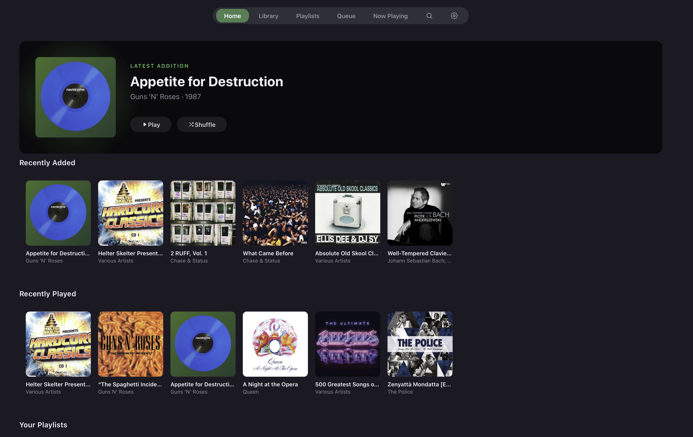
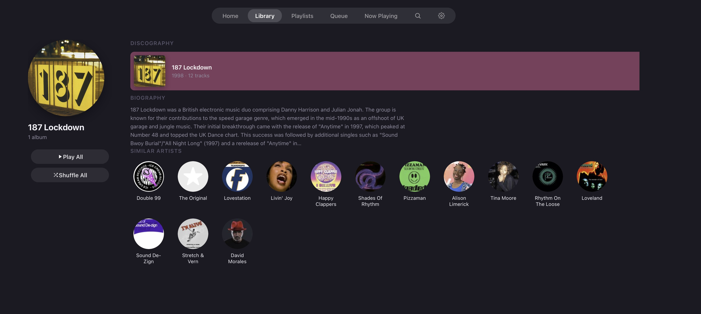
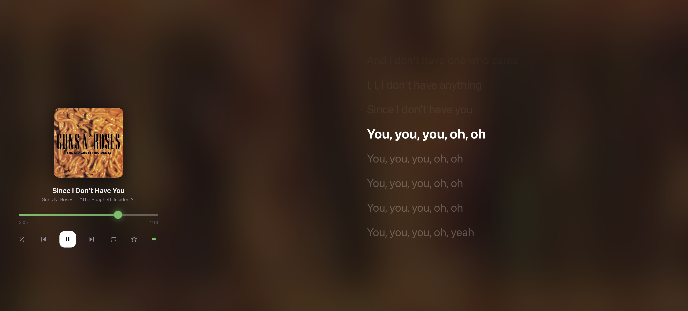
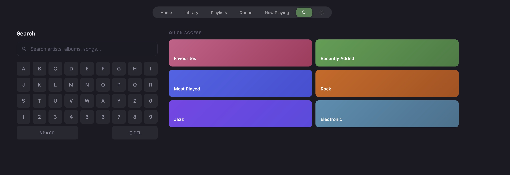

# Sonance3

**A music player for Samsung Tizen TVs, built to stream from your self-hosted Navidrome or Subsonic-compatible server.**

Sonance turns your Samsung smart TV into a full-featured music player. Browse your library, play albums, search your collection, and enjoy synced lyrics — all from your sofa with just the TV remote.

This is Version3 of Sonance - a UI rewrite which includes a completely new hardware accelerated UI, multiple library support.

## Features

- **Full library browsing** — albums, artists, songs, genres, and playlists
- **Multiple Library Support** - Supports Navidromes Multiple libraries per server (select in Settings)
- **Artist detail pages** — discography, biography (via Last.fm), and similar artists
- **Synced lyrics** — Apple Music-style timed lyrics that scroll with the music, with configurable timing offset
- **Favourites** — star/unstar albums and songs, synced back to your server
- **Near-gapless playback** — pre-buffers the next track for seamless album listening
- **D-pad navigation** — fully designed for TV remote control, no mouse or touch needed
- **Samsung remote media keys** — play, pause, skip, and previous all work natively
- **Customisable accent colour** — choose from 8 colour themes, applied across the entire app
- **Queue management** — add to queue, play next, and remove tracks using the remote's colour buttons
- **Search** — on-screen keyboard with instant results across artists, albums, and songs
- **Persistent settings** — lyrics offset, accent colour, and preferences survive app restarts
- **AVPlay backend** — uses Samsung's native audio engine for hardware-decoded FLAC, AAC, MP3, and more
- **Lightweight** — under 200KB total, zero external dependencies, pure vanilla JS

## Screenshots









## Requirements

- **Samsung Smart TV** — 2019 or newer (Tizen 5.0+). Developed and tested on a Samsung Q90R.
- **Navidrome** (or any Subsonic API-compatible server) — running on your local network
- **Developer Mode** enabled on the TV — required for sideloading

## Installation

### Option 1: Pre-built .wgt (easiest)

1. Download `Sonance3.wgt` from the [latest release](../../releases/latest)
2. Install using [Jellyfin2Samsung](https://github.com/Jellyfin2Samsung/Samsung-Jellyfin-Installer):
   - Enable Developer Mode on your TV (Settings → Apps → Developer Mode)
   - Open Jellyfin2Samsung on your computer
   - Go to Settings → select the downloaded `Sonance.wgt`
   - Enter your TV's IP address and install

### Option 2: Build from source

```bash
git clone https://github.com/YOUR_USERNAME/sonance3.git
cd sonance3
bash build.sh
```

This creates `Sonance3.wgt` (~200KB) which you can install via Jellyfin2Samsung.

## Setup

1. Launch Sonance on your TV
2. Enter your server address (e.g. `192.168.0.1`) and port (e.g. `4533`)
3. Enter your username and password
4. You're in — start browsing and playing

Sonance communicates with your server via the Subsonic REST API. 

## Remote Controls

| Button | Action |
|--------|--------|
| **Arrow keys** | Navigate menus and screens |
| **Enter/OK** | Select, play track, toggle controls |
| **Back** | Go to previous screen |
| **Play/Pause** | Play or pause music |
| **Green** | Toggle favourite on focused track |
| **Yellow** | Add focused track to queue |
| **Blue** | Play focused track next |
| **Red** | Remove focused track from queue |
| **Left/Right** (on settings) | Adjust values (lyrics offset, accent colour) |

## Settings

Access via the sidebar → Settings:

- **Auto Now Playing** — automatically navigate to the Now Playing screen when a song starts (default: on)
- **Accent Colour** — choose from 8 colour themes (pink, red, orange, amber, green, teal, blue, purple)
- **Library Selection** - select which (or all) of your Navidrome libraries you wish to use

All settings persist between app restarts.

## Lyrics

Sonance supports synced (timed) lyrics via the OpenSubsonic `getLyricsBySongId` API. To use them:

1. Place `.lrc` files alongside your music files in Navidrome, matching the song filename
2. Navidrome will serve them automatically via the API
3. In Sonance, press the lyrics button on the Now Playing screen to toggle the lyrics panel

The lyrics panel shows the current line highlighted in bold, with past and upcoming lines faded. It auto-scrolls to keep the active line visible.

## Tech Stack

- **Vanilla JavaScript** (ES2017) — no frameworks, no build tools, no npm
- **Samsung AVPlay API** — native hardware audio decoding on the TV
- **HTML5 Audio** fallback — for browser-based development and testing
- **Subsonic REST API** — compatible with Navidrome, Subsonic, Airsonic, and others
- **Tizen Web App** — packaged as a `.wgt` widget

The entire app is ~100KB and loads instantly. Zero external dependencies.

## Development

### Local testing

```bash
# Start a local dev server
python3 -m http.server 8080

# Open http://localhost:8080 in your browser
```

The app runs in any modern browser for development. AVPlay features (hardware decoding, media keys) only work on the TV — the browser uses HTML5 Audio as a fallback. 


### Project structure

```
sonance/
├── index.html          # App entry point
├── config.xml          # Tizen widget configuration
├── icon.png            # App icon
├── build.sh            # Build script → Sonance.wgt
├── css/
│   └── styles.css      # All styles
├── js/
│   ├── app.js          # App shell, routing, settings
│   ├── api.js          # Subsonic API client
│   ├── auth.js         # Authentication manager
│   ├── player.js       # Dual-backend audio engine (AVPlay + HTML5)
│   ├── focus.js        # D-pad focus management
│   ├── components.js   # Shared UI components
│   ├── starred.js      # Favourites cache
│   ├── utils.js        # Helpers, pagination
│   └── screens/        # One file per screen
│       ├── home.js
│       ├── library.js
│       ├── album.js
│       ├── artist.js
│       ├── search.js
│       ├── nowplaying.js
│       ├── queue.js
│       ├── playlists.js
│       ├── settings.js
│       └── login.js
```

### Tizen 5.0 / Chromium 63 constraints

This app targets Samsung TVs from 2019, which run Chromium 63. Key limitations that apply to any contributions:

- No CSS `gap` on flex containers — use `margin` on children
- No `backdrop-filter` — use `filter: blur()` on elements
- No `aspect-ratio` CSS — use the `padding-bottom` percentage trick
- No optional chaining (`?.`), nullish coalescing (`??`), `Array.flat()`, or `Object.fromEntries()`
- `scrollIntoView` with options is unreliable — use manual scroll calculations
- Use `webkitAudioContext` as fallback for `AudioContext`
- Use `grid-gap` not `gap` for CSS Grid
- Passwords are stored in localstorage in plain text on the TV. This is a limitation of Tizen without trying to build an encryption library.


## Licence

GNU GPL v3. You are free to use this however you want as long as it stays free and open-source. You cannot commercialise this or close source any version of it. 
You cannot use this to train AI.

## Acknowledgements

- [Navidrome](https://www.navidrome.org/) — the excellent self-hosted music server that makes this possible
- [Subsonic API](http://www.subsonic.org/pages/api.jsp) and [OpenSubsonic](https://opensubsonic.netlify.app/) — the API that ties it all together
- [Jellyfin2Samsung](https://github.com/nicko88/Jellyfin2Samsung) — for making Tizen sideloading painless
- [Samsung Tizen Developer](https://developer.samsung.com/smarttv/) — AVPlay API documentation
